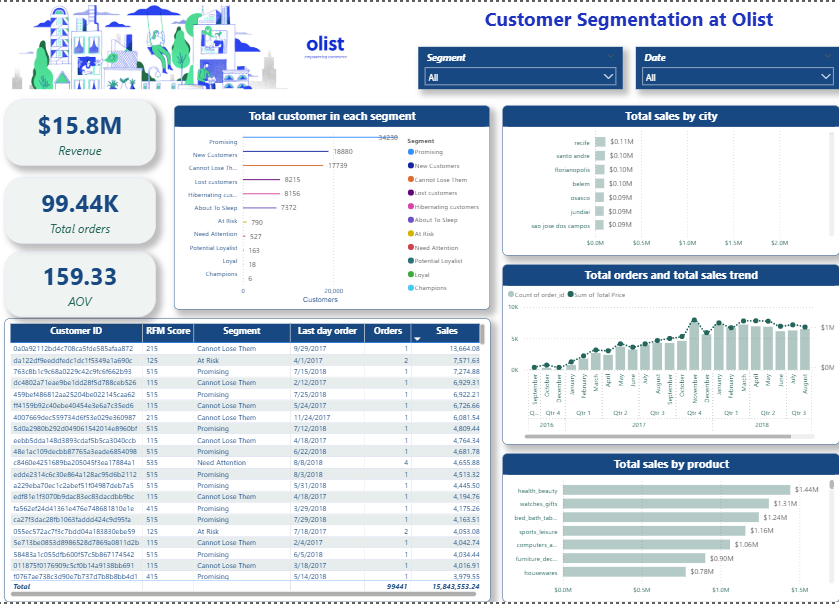

# Olist Customer Segmentation Analysis




## Project Overview

This project analyzes customer behavior from Olist, the largest department store marketplace in Brazil.

The objective is to identify valuable customers, understand customer churn patterns and provide insights to support customer retention strategies.

The analysis applies RFM (Recency, Frequency, Monetary) segmentation to classify customers based on purchasing behavior.


## Business Problem

Olist wants to answer key business questions:

- Who are the most valuable customers?
- Which customers are at risk of leaving?
- Which customer groups require retention strategies?
- How can customer value and revenue performance be improved?


## Tools & Techniques

- Power BI
- Data Cleaning
- Customer Segmentation
- RFM Analysis
- Business Intelligence Dashboard
- Data Visualization


# Methodology

## RFM Customer Segmentation

Customers were evaluated based on three key metrics:

| Metric | Description |
|---|---|
| Recency | How recently a customer made a purchase |
| Frequency | How often a customer purchases |
| Monetary | Total revenue generated by a customer |


Based on RFM scores, customers were classified into different segments:

- Champions
- Loyalty Customers
- Cannot Lose Them
- At Risk
- About To Sleep
- Lost Customers


# Key Insights


## 1. Best Customers

Champions and Loyalty customers represent Olist's highest-value customer segments.

### Champions

- 6 customers
- 20 orders
- Approximately $1.86K revenue


### Loyalty Customers

- 17 customers
- Approximately $6.4K revenue


## 2. Customer Churn Analysis

Lost customers represent previous buyers who have not returned for a considerable period.

Although they are no longer active, this segment generated significant historical revenue, highlighting the importance of customer retention strategies.


## 3. At-Risk Customers

Several customer groups require retention actions:

- Cannot Lose Them
- At Risk
- About To Sleep


These customers still represent potential revenue opportunities if appropriate engagement strategies are applied.


# Dashboard Preview


## Executive Dashboard


## Revenue & Order Performance


## RFM Segmentation Analysis


# Project Files

- Business Intelligence Report
- Customer Segmentation Analysis
- Dataset
- Methodology Documentation


# Repository Structure
```text
Olist-Customer-Segmentation/

├── Dataset/

├── Documentation/
│   └── methodology.md

├── Report/
│   └── Business_Intelligence_Report.pdf

├── Images/
│   ├── Dashboard.png
│   ├── Customer segmentation.png
│   ├── Segmentation by RFM score.png
│   └── Total orders and Sales.png

└── README.md
```

# Author

Vu Chi Anh Nguyen (Charlotte)

Business Intelligence | Data Analytics
